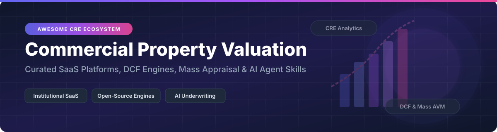

  

# 🏢 Awesome Commercial Property Valuation

  
  
  
  
  
  

> **A curated directory of Commercial Real Estate (CRE) Property Valuation SaaS platforms, DCF Modeling engines, Automated Valuation Models (AVM), AI Underwriting Skills, and Data Standards.**

---

## 📌 Overview & SEO Summary

Commercial property valuation software enables appraisers, commercial real estate brokers, investment analysts, asset managers, and lenders to estimate property values, perform **Discounted Cash Flow (DCF)** modeling, execute **mass appraisals**, and streamline **lease abstraction**. Whether you need institutional-grade SaaS platforms like **Argus Enterprise** or open-source Python/R libraries for custom algorithmic underwriting, this guide outlines the top tools available in 2026.

---

## 🏬 SaaS / Hosted Platforms

> **Market Analysis & Fragmentation:**  
> The commercial property valuation software market is estimated at **$4.8 Billion USD in 2026** (projected to reach $8.5 Billion by 2031 at a 12.1% CAGR). The market structure is **moderately concentrated** at the institutional tier—where **Argus Enterprise (Altus Group)** functions as a near "winner-take-most" standard for institutional office/retail DCF modeling—while remaining **fragmented** in specialized niches like broker lease comps (CompStak), public record graph intelligence (Cherre, Reonomy), and appraisal report management (Valcre, LightBox).

| SaaS Platform 🏢 | Valuation / Funding / Company Size 💰 | Pricing Model 🏷️ | Free Tier / Free Trial Limits 🎁 | Primary Capabilities & Features 🚀 |
| :--- | :--- | :--- | :--- | :--- |
| **[Argus Enterprise](https://www.altusgroup.com/argus/)** 🏢 | **~$1.8B+ Market Cap** (Altus Group public listing TSX: AIF; ~$500M+ Annual ARR) | Enterprise subscription: ~$3,000 – $5,000 per user/year | **No free trial** (Sales demo upon request only) | De facto institutional CRE valuation standard; asset cash flow forecasting, lease modeling, and portfolio sensitivity analysis. |
| **[LightBox Valuation](https://www.lightboxre.com/)** 💡 | **~$350M+ Valuation** ($280M–$500M Est. Revenue; Backed by Silver Lake & Battery Ventures) | Commercial tier: Starting at ~$129 per user/month | **10-day free trial** with full data lookup privileges | CRE property data, environmental assessment, appraisal management, and spatial analytics. |
| **[HouseCanary](https://www.housecanary.com/)** 🏠 | **~$130M Total Funding** (Institutional valuation undisclosed; undergoing CRE restructuring) | Pro plans: Starting at ~$19 per month | **7-day free trial** with limited property lookup tokens | Automated Valuation Models (AVM), neighborhood analytics, and residential/commercial property risk scoring. |
| **[Reonomy](https://www.reonomy.com/)** 🔍 | **~$128M Funding** (Acquired by Altus Group for ~$201M) | Core subscription: ~$400 per month (billed annually) | **7-day free trial** (Requires verified business email) | AI-powered CRE property intelligence, true ownership entity unmasking, mortgage data, and debt maturity tracking. |
| **[Cherre](https://cherre.com/)** 🌐 | **~$105M Total Funding** ($30M Series C in 2024) | Enterprise data licensing: Custom quotes starting at ~$1,000/mo | **Free sandbox account** (Allows schema preview & data dictionary testing) | Real estate data integration platform connecting internal portfolio data with external CRE market data feeds. |
| **[CompStak](https://www.compstak.com/)** 📊 | **~$80M Total Funding** ($50M Series C) | Individual team plans: Starting at ~$199 per month | **Free for Brokers/Appraisers** who trade verified comps; **48-hour trial** for enterprise accounts | Crowdsourced commercial lease comps, sales comp analytics, and market rent benchmarks. |
| **[Dealpath Analytics](https://www.dealpath.com/)** 📈 | **~$50M Funding** ($100M–$250M estimated valuation) | Enterprise plan: Custom quotes starting at ~$500 per seat/month | **No free trial** (Interactive demo upon request) | CRE deal management pipeline, investment committee reporting, and underwriting workflow tracking. |
| **[Valcre](https://www.valcre.com/)** 📝 | **~$51M Valuation** ($12.7M Series A Funding) | Professional appraisal tier: Custom quotes from ~$250 per user/month | **No free trial** (Custom demo & sample report preview) | End-to-end appraisal platform designed for valuation firms; automated report building, comp management, and job tracking. |
| **[Crexi Intelligence](https://www.crexi.com/)** 🏛️ | **Venture Backed** (Private growth-stage, valuation undisclosed) | Crexi Intelligence subscription: ~$120 per month | **No free trial** (Free registration allows basic property search only) | Commercial marketplace data, historical sale transactions, cap rate trends, and underwriting intelligence. |
| **[PropMix](https://propmix.io/)** ⚡ | **Private Bootstrapped / Seed** (Valuation undisclosed) | Pay-as-you-go API: Starting at ~$0.10 per valuation API call | **Free Developer Tier** with 100 API calls/month limit | AI-driven real estate valuation APIs, appraiser workflow automation, and property data analytics. |

---

## 🔓 Open-Source GitHub Projects

> **Stars_Count Benchmark:** Sorted by GitHub_Stars_Count (Descending). Click any Stars_Badge to inspect the stargazers page! 🌟

### 🛠️ DCF Modeling, AVM Engines, AI Agents & Data Standards

- **[ccao-data/model-res-avm](https://github.com/ccao-data/model-res-avm)** 🏠
  
  **Production Automated Valuation Model (AVM) from Cook County Assessor's Office.** Built with R and LightGBM. Uses SHAP values for explainable machine learning predictions across hundreds of thousands of properties. *AGPL-3.0 Licensed.*

- **[ibpdi/cdm](https://github.com/ibpdi/cdm)** 📐
  
  **Common Data Model for Real Estate (International Building Performance & Data Initiative).** Global open-source JSON/YAML schemas for asset management, energy performance, lease terms, and financial valuation interoperability. *MIT / CC-BY-4.0 Licensed.*

- **[daniel-fink/rangekeeper](https://github.com/daniel-fink/rangekeeper)** 🧮
  
  **Recomposable Commercial Real Estate Financial DCF Modeling Engine.** Python library implementing Geltner & de Neufville flexibility and real estate valuation under uncertainty. Supports Grasshopper 3D integration. *Open Source.*

- **[ahmnouira/pillar-landing](https://github.com/ahmnouira/pillar-landing)** 🏛️
  
  **Institutional Commercial Real Estate Investment Platform.** Next.js and Node.js platform for commercial property deal discovery, due diligence, and direct investment syndication. *MIT Licensed.*

- **[dmai287/real-estate-avm](https://github.com/dmai287/real-estate-avm)** 🤖
  
  **Machine Learning Property Automated Valuation Engine.** Uses XGBoost, Random Forest, and Linear Regression with Flask REST API for residential and commercial valuation benchmarking. *Open Source.*

- **[asifpy/landlord](https://github.com/asifpy/landlord)** 🔑
  
  **Property Valuation & Management Tool.** Django REST Framework backend for tracking rental yields, property valuation history, and cash flow performance. *MIT Licensed.*

- **[galtproject/galtproject-docs](https://github.com/galtproject/galtproject-docs)** ⛓️
  
  **On-Chain Property Valuation & Land Registry Protocol.** Decentralized land registration and automated property valuation smart contracts protocol. *MIT Licensed.*

- **[bashovski/apollo](https://github.com/bashovski/apollo)** 🏢
  
  **Commercial Real Estate Analytics & Listing System.** Laravel and Vue.js platform for managing commercial property listings, valuation metrics, and broker deal flows. *MIT Licensed.*

- **[CRE-AI-Skills](https://github.com/cre-ai-skills/CRE-AI-Skills)** 🧠
  
  **AI Agent Skills for Commercial Real Estate Underwriting.** Modular Claude Code & ChatGPT prompts covering lease abstracting, debt sizing, rent roll audit, and Investment Committee memo generation. *Apache 2.0 Licensed.*

- **[ahacker-1/cre-agent-skills](https://github.com/ahacker-1/cre-agent-skills)** ⚡
  
  **90+ Open-Source AI Skills for Commercial Underwriting & Lease Analysis.** Comprehensive skill packs across Multifamily, Office, Retail, Industrial, and Debt Capital Markets. Zero dependency workflow. *Apache 2.0 Licensed.*

- **[cre.dcf (CRAN R Package)](https://cran.r-project.org/package=cre.dcf)** 📈
  
  **Commercial Real Estate DCF Engine for R.** Generates unlevered/levered DCF tables, debt schedules, DSCR, and forward LTV calculations from YAML configs. *MIT Licensed.*

- **[OpenAVMKit](https://pypi.org/project/openavmkit/)** PyPI 🐍
  
  **Python Mass Appraisal & Automated Valuation Toolkit.** Complete data pipeline for property data cleaning, feature engineering, and mass appraisal assessment. *MIT Licensed.*

- **[SignalTruth](https://roxanneardary.com/signaltruth/)** 📡
  
  **Public Record Commercial Real Estate Market Reconstruction Graph.** AGPL-3.0 knowledge graph tracing property transfers, lease events, and property assessment confidence scores. *AGPL 3.0+ Licensed.*

---

## 🛠️ How to Contribute

1. **Fork the Repository** 🍴
2. **Add or Edit Entries** in `README.md` following the tabular or bullet format.
3. **Ensure Accuracy**: Provide exact links, license information, Stars_Counts, or starting subscription pricing.
4. **Submit a Pull Request** with a brief summary of the changes.

---

## ⚖️ Disclaimer

This list is community-curated for informational, academic, and software development research purposes. Commercial real estate property valuations involve substantial financial risk; ensure all valuation models comply with professional standards such as USPAP (Uniform Standards of Professional Appraisal Practice) and IVS (International Valuation Standards).

---

## 🤝 Support & Sponsorship

If you find this curated list valuable for your commercial real estate underwriting, PropTech development, or valuation research, please consider supporting the project! ⭐️

- 🌟 **Star this repository** to help others discover it!
- 🔀 **Fork it** to contribute new SaaS platforms or open-source libraries.
- 📢 **Share** with your colleagues, appraisers, and CRE analysts.
- ☕ **Buy me a coffee / Sponsor**: Support ongoing maintenance via [GitHub Sponsors](https://github.com/sponsors/ishandutta2007).

---

## 📈 Star History

---

  <b>Built with ❤️ for Commercial Real Estate Appraisers, Underwriters, PropTech Developers, and CRE Analysts.</b>

